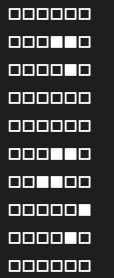
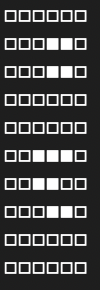
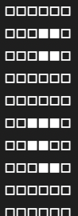
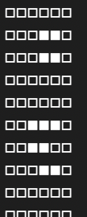
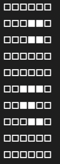

# Game_of_life_PCPC
 Il Gioco della vita (Game of Life in inglese, noto anche solo come Life) è un automa cellulare sviluppato dal matematico inglese John Conway sul finire degli anni sessanta. Il Gioco della vita è l'esempio più famoso di automa cellulare: il suo scopo è quello di mostrare come comportamenti simili alla vita possano emergere da regole semplici e interazioni a molti corpi.

Si tratta in realtà di un "gioco senza giocatori", intendendo che la sua evoluzione è determinata dal suo stato iniziale, senza necessità di alcun input da parte di giocatori umani. Si svolge su una griglia di caselle quadrata (celle); definita **mondo**. Ogni cella ha otto **vicini**, che sono celle ad essa adiacenti. Ogni cella può trovarsi in due stati: **viva** o **morta**. Lo stato della griglia evolve in intervalli di tempo discreti, cioè scanditi in maniera netta. Gli stati di tutte le celle in un dato istante sono usati per calcolare lo stato delle celle all'istante successivo. Tutte le celle del mondo vengono quindi aggiornate simultaneamente nel passaggio da un istante a quello successivo: passa così una **generazione**.

Le transizioni dipendono unicamente dallo stato delle celle vicine in quella generazione:
* Qualsiasi cella viva con meno di due celle vive adiacenti muore, come per effetto d'isolamento;
* Qualsiasi cella viva co due o tre celle vive adiacenti sopravvive alla generazione successiva;
* Qualsiasi cella viva con più di tre celle vive adiacenti muore, come per effetto di sovrappopolazione;
* Qualsiasi cella morta con esattamente tre celle vive adiacenti diventa una cella viva, come per effetto di riproduzione.

<p align="center">
    
</p>

## Come compilare ed eseguire?
Per compilare il codice .c non sono necessari particolari sforzi. Eseguire il seguente comando:

```
mpicc game_of_life.c -o game_of_life.out
```

Per eseguire il file compilato è necessario eseguire il seguente comando:

```
mpirun -np {VCPUs} game_of_life.out {righe} {colonne} {generazioni}
```

## Descrizione della soluzione adottata

### Funzioni definite
Iniziamo con il definire in particolare quelle che saranno le funzioni principali definite per Game of Life. In particolare esse definiscono la logica del gioco in relazione alla presenza di celle vive o morte.

### is_alive(bool)
Data in input una cella della matrice valuto se essa è viva o morta.

**Signature del metodo**

```c
bool is_alive(bool cell);
```
| Parametro | Tipo | Descrizione |
|--|--|--|
| cell | bool | La cella che si vuole valutare |

```c
bool is_alive(bool cell)
{
    return cell == 1;
}
```
---
### game_update(bool*, bool*, int, int)
Data in input la sottomatrice originale, la sottomatrice da aggiornare, l'indice della cella corrente e il numero di celle vive attorno ad essa, il metodo si occupa di applicare le regole del gioco descritte in precedeza.

**Signature del metodo**

```c
void game_update(bool *receive_buffer, bool *updated_buffer, int cell_index, int count)
```

| Parametro | Tipo | Descrizione |
|--|--|--|
| receive_buffer | bool* | il buffer originale, quello in cui si trova la cella da analizzare |
| updated_buffer | bool* | il buffer di destinazione, quello in cui salvare lo stato della cella che stiamo analizzando |
| cell_index | int | la cella da analizzare |
| count| int | numero di celle vive vicine alla cella da analizzare |

```c
void game_update(bool *receive_buffer, bool *updated_buffer, int cell_index, int count)
{
    //se la cella è viva applico le regole del gioco
    if (isAlive(receive_buffer[cell_index]))
    {
        if (count < 2)
            updated_buffer[cell_index] = 0;
        else if (count > 3)
            updated_buffer[cell_index] = 0;
        else
            updated_buffer[cell_index] = 1;
    }
    else
    { //se la cella è morta valuto se resuscitarla o meno
        if (count == 3)
            updated_buffer[cell_index] = 1;
        else
            updated_buffer[cell_index] = 0;
    }
}
```

### Main
Procediamo la descrizione con la spiegazione del codice main definito per Game of Life. 
Iniziamo con la presentazione delle variabili usate per il programma.

```c
int main(int argc, char *argv[])
{
    //rank e size del comunicatore
    int my_rank = 0;
    int comm_size = 0;

    //valori per la matrice
    bool *matrix; //la considero come un array per semplicità nelle operazioni
    int row = atoi(argv[1]);
    int col = atoi(argv[2]);

    //generazioni da eseguire
    int generations = atoi(argv[3]); //generazione specificate in input

    //valori per calcolare le porzioni da inviare
    int steps = 0;      //numero di generazioni da eseguire
    int numElem = 0;    //numero di elementi da inviare per processo
    int rest = 0;       //se c'è resto invio degli elementi in più ai processi finchè il resto è diverso da 0
    int *send_counts;   //array contenente il numero di elementi da inviare per ogni processo
    int *displacements; //calcolo lo spostamento relativo al buffer da inviare con la scatterv
    int count = 0;      //utile per calcolare il displacement
    bool *rec_buf;      //buffer in ricezione per la scatterv
    bool *updated_buf;  //buffer aggiornato dopo lo step di gioco
    bool *top_row;      //prima riga da inviare al predecessore
    bool *bottom_row;   //ultima riga da inviare al successore
    int prev;           //valore del predecessore
    int next;           //valore del successore

    MPI_Request top_request, bottom_request; //request per invio della prima e ultima riga
    MPI_Status status;
    MPI_Datatype life_row;    
    MPI_Group world_group; //gruppo primario per la comunicazione
    MPI_Group new_group;
    MPI_Comm NEW_MPI_COMM_WORLD; 

}
```

Continuiamo con l'inizializzazione dell'ambiente MPI. Specificando ed ottenento il numero di processi in esecuzione (`comm_size`) e il rank del processo in esecuzione (`my_rank`).

```c
MPI_Init(&argc, &argv);
MPI_Comm_rank(MPI_COMM_WORLD, &my_rank);
MPI_Comm_size(MPI_COMM_WORLD, &comm_size);
```

Successivamente dichiaro un tipo MPI contigous derivato chiamato life_row. Fondamentale per inviare direttamente ai processi le righe da manipolare. Tale tipo si compone di "numero di colonne" elementi di tipo `bool`. Infine si esegue il commit.

```c
MPI_Type_contiguous(col, MPI_C_BOOL, &life_row);
MPI_Type_commit(&life_row);
```

Se il numero di processi in uso è maggiore del numero di righe c'è bisogno di eliminare i processi in eccesso. Semplicemente, in caso affermativo, creo un nuovo comunicatore contenente soltanto i processi necessari; in caso contrario creo un comunicatore con il numero di processi specificati in input.

```c
if(comm_size > row){
        
    int new_rank[row];

    for(int i = 0; i < row; i++)
        new_rank[i] = i;

    //creo un nuovo gruppo con i soli processi di cui ho bisogno
    MPI_Group_incl(world_group, row, new_rank, &new_group);

    //creo il nuovo comunicatore
    MPI_Comm_create(MPI_COMM_WORLD, new_group, &NEW_MPI_COMM_WORLD);
}
else
{
    MPI_Comm_create(MPI_COMM_WORLD, world_group, &NEW_MPI_COMM_WORLD);
}

if (NEW_MPI_COMM_WORLD == MPI_COMM_NULL)
{
    // elimino i processi in eccesso
    MPI_Finalize();
    exit(0);
}
```

A tal punto il processo MASTER (rank 0) inizializza la matrice e la popola in maniera pseudocasuale. Tramite la random verrà generato un numero compreso tra 0 e 1:
- se la cella è viva il suo valore è 1
- se la cella è morta il suo valore è 0

```c
//inizializzo il seed della rand
srand(time(NULL) + my_rank);

if (my_rank == 0)
{
    matrix = calloc(row * col, sizeof(bool));

    //inizializzo randomicamente la matrice, con valori 0 o 1 per ogni celle
    for (int i = 0; i < row; i++)
    {
        for (int j = 0; j < col; j++)
        {
            matrix[i * col + j] = rand() % 2;
        }
    }

    //stampa della matrice iniziale
    for (int i = 0; i < row; i++
    {
        for (int j = 0; j < col; j++)
        {
            (matrix[i * col + j]) ? printf("\u25FC") : printf("\u25FB");
        }
        printf("\n");
    }
}
```

Calcolo il numero di righe da assegnare ad ogni processo. La divisione viene effettuata distribuendo le righe in maniera equa tra tutti i processi in uso; nel caso in cui la divisione tra il numero di righe e il numero di processi abbia un resto r, allora i primi r processi avranno una riga in più rispetto ai restanti `comm_size` - r.

```c
numElem = row / comm_size;
rest = row % comm_size;

send_counts = calloc(comm_size, sizeof(int));
displacements = calloc(comm_size, sizeof(int));

//assegno ad ogni processo il numero corretto di elementi ed incremento lo spostamento
for (int i = 0; i < comm_size; i++)
{
     send_counts[i] = numElem;

     if (rest > 0)
     {
     send_counts[i]++;
     rest--;
     }

     displacements[i] = count;
     count += send_counts[i];
}
```

Procediamo con l'inizializzazione delle risorse che sfrutteremo in seguito.

```c
//alloco la memoria per i buffer da inviare ai vari processi
rec_buf = calloc(send_counts[my_rank] * col, sizeof(bool));
updated_buf = calloc(send_counts[my_rank] * col, sizeof(bool));
top_row = calloc(col, sizeof(bool));
bottom_row = calloc(col, sizeof(bool));
```

La soluzione proposta è concepita per lavorare in maniera toroidale, ciò implica che la prima riga valuterà come ghost row superiore l'ultima riga della matrice e, viceversa, l'ultima riga valuterà come ghost row inferiore la prima riga. 
In base a ciò è necessario calcolare i predecessori ed i successori dei processi al fine di inviare correttamente le righe.

```c
//se sono il processo 0 allora il mio predecessore è il processo con rank ultimo altrimenti rank - 1 
prev = (my_rank == 0) ? comm_size - 1 : my_rank - 1;

//se sono l'ultimo processo il mio successore è rank 0 altrimenti rank + 1
next = (my_rank + 1) == comm_size ? 0 : my_rank + 1;
```

A tal punto iniziamo un ciclo che si ripete un numero di volte pari al numero di generazioni specificate in input

```c
//eseguo tante volte quante sono le generazioni 
while (steps < generations)
{
    //logica di gioco
}
```

All'interno del ciclo, per prima cosa, si distibuisce la matrice creata tra i processi tramite una `ScatterV`. Successivamente ogni processo invia in maniera non bloccante (`Isend`) la sua prima riga al predecessore e la sua ultima riga al successore. E' bene notare che in caso di uno o due processi le righe inviate dovranno essere inverite al fine di evitare errori in fase di analisi. 

```c
//invio ad ogni processo le righe che gli spettano per il calcolo
MPI_Scatterv(matrix, send_counts, displacements, life_row, rec_buf, send_counts[my_rank], life_row, 0, MPI_COMM_WORLD);

//numero di righe per processo
int rowsNumber = send_counts[my_rank];

//se predecessore e successore sono diversi 
if (prev != next)
{
    //invio la prima riga della matrice ricevuta al mio predecessore
    MPI_Isend(rec_buf, 1, life_row, prev, 1, MPI_COMM_WORLD, &top_request);
    //invio l'ultima riga al mio successore
    MPI_Isend(rec_buf + (col * (rowsNumber - 1)), 1, life_row, next, 1, MPI_COMM_WORLD, &bottom_request)
} 
else
{
    //nel caso di uno o due processi devo invertire prima e ultima riga da inviare
    MPI_Isend(rec_buf + (col * (rowsNumber - 1)), 1, life_row, prev, 1, MPI_COMM_WORLD, &top_request);
    MPI_Isend(rec_buf, 1, life_row, next, 1, MPI_COMM_WORLD, &bottom_request);
}

//prendo l'ultima riga del predecessore
MPI_Recv(top_row, col, life_row, prev, 1, MPI_COMM_WORLD, &status);
//prendo la prima riga del successore
MPI_Recv(bottom_row, col, life_row, next, 1, MPI_COMM_WORLD, &status);
```

Il seguente blocco di codice è il cuore pulsante della soluzione, si va a scorrere la sotto-matrice che ogni processo ha ricevuto andando a valutare ogni cella in relazione con i suoi vicini. Da sottolineare che per la prima e ultima riga è importante considerare le ghost rows ricevute dagli altri processi.
Nello specifico, per ogni cella i processi controllano se le celle intorno ad essa sono vive e in caso affermativo, viene incrementata una variabile `count`.
Al termine della valutazione, si valuta lo stato della cella attraverso la funzione `game_update` descritta in precedenza.

```c
//per ogni riga che ho
        for (int i = 0; i < rowsNumber; i++)
        {
            //per ogni colonna
            for (int j = 0; j < col; j++)
            {
                //sono nella cella
                //conto quante celle vive vicine ci sono per ogni cella
                int count = 0;

                //se sto nella prima riga devo considerare la ghost row ottenuta dal predecessore
                if (i == 0)
                {
                    //considero la ghost row top
                    for (int active_col = j - 1; active_col < j + 2; active_col++)
                    {
                        if (active_col > -1 && active_col < col)
                            count = is_alive(top_row[active_col]) ? count + 1 : count;
                    }

                    //valuto il vicino sinistro
                    if (j > 0)
                        count = is_alive(rec_buf[i * col + (j - 1)]) ? count + 1 : count;

                    //valuto il vicino destro
                    if (j < col - 1)
                        count = is_alive(rec_buf[i * col + (j + 1)]) ? count + 1 : count;;

                    //caso in cui ho soltanto una riga, non voglio che entri
                    if (i != rowsNumber - 1)
                    {
                        //considero la riga sottostante
                        for (int active_col = j - 1; active_col < j + 2; active_col++)
                        {
                            if (active_col > -1 && active_col < col)
                                count = is_alive(rec_buf[(i + 1) * col + active_col]) ? count + 1 : count;
                        }
                    }
                }

                if (i > 0 && i < rowsNumber - 1)
                {
                    //considero la riga in top
                    for (int active_col = j - 1; active_col < j + 2; active_col++)
                    {
                        if (active_col > -1 && active_col < col)
                            count = is_alive(rec_buf[(i - 1) * col + active_col]) ? count + 1 : count;
                    }

                    //valuto il vicino sinistro
                    if (j > 0)
                        count = is_alive(rec_buf[i * col + (j - 1)]) ? count + 1 : count;

                    //valuto il vicino destro
                    if (j < col - 1)
                        count = is_alive(rec_buf[i * col + (j + 1)]) ? count + 1 : count;

                    //valuto la row bottom
                    for (int active_col = j - 1; active_col < j + 2; active_col++)
                    {
                        if (active_col > -1 && active_col < col)
                            count = is_alive(rec_buf[(i + 1) * col + active_col]) ? count + 1 : count;
                    }
                }

                //nell'ultima considero la ghost ricevuta dal successore
                if (i == rowsNumber - 1)
                {
                    //caso in cui ho soltanto una riga, non voglio che entri
                    if (i != 0)
                    {
                        //considero la riga in top
                        for (int active_col = j - 1; active_col < j + 2; active_col++)
                        {
                            if (active_col > -1 && active_col < col)
                                count = is_alive(rec_buf[(i - 1) * col + active_col]) ? count + 1 : count;
                        }

                        //valuto il vicino sinistro
                        if (j > 0)
                            count = is_alive(rec_buf[i * col + (j - 1)]) ? count + 1 : count;

                        //valuto il vicino destro
                        if (j < col - 1)
                            count = is_alive(rec_buf[i * col + (j + 1)]) ? count + 1 : count;
                    }

                    //valuto la ghost row bottom
                    for (int active_col = j - 1; active_col < j + 2; active_col++)
                    {
                        if (active_col > -1 && active_col < col)
                            count = is_alive(bottom_row[active_col]) ? count + 1 : count;
                    }
                }

                //applico le regole del gioco
                game_update(rec_buf, updated_buf, i * col + j, count);
            }
        }
```

Al termine della computazione delle celle è necessario invocare una `Gatherv` al fine di ricombinare la matrice con i risultati della generazione.

```c
//gather per ricombinare la matrice, prendo gli elementi dal buffer aggiornato e ricostruisco matrix
MPI_Gatherv(updated_buf, send_counts[my_rank], life_row, matrix, send_counts, displacements, life_row, 0, MPI_COMM_WORLD);
```

Una volte usciti dal ciclo, si libera la memoria, si attende che tutti i processi portino a termine il lavoro e si termina l'esecuzione.

```c
free(rec_buf);
free(updated_buf);
free(top_row);
free(bottom_row);
free(send_counts);
free(displacements);

MPI_Finalize();

//la matrix iniziale viene inizializzata soltanto dal master, il quale procederà con la free
if(my_rank == 0){
    free(matrix);
}
```

## Verifica della correttezza
Al fine di dimostrare la correttezza della soluzione proposta, si è fatto uso di un pattern fisso per l'inizializzazione della matrice; in modo da verificare che l'output rimanga invariato al variare del numeri di processi che si utilizza.

<center></center>

Fissato il numero di iterazioni pari a 1, un numero di righe pari a 6 e un numero di colonne pari a 10 si è fatto eseguire il codice sia su algoritmo sequenziale che su algoritmo parallelo con 2, 3 e 4 processi.

| Sequenziale | 2 processi | 3 processi | 4 processi |
| --- | --- | --- | --- |
|  |  |  |  |

Come è evidente il risultato è il medesimo nonostante la variazione sul numero di processi in uso.
